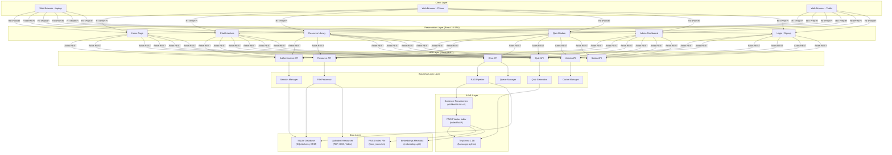
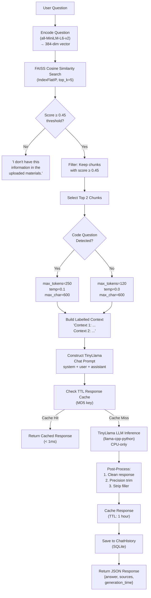
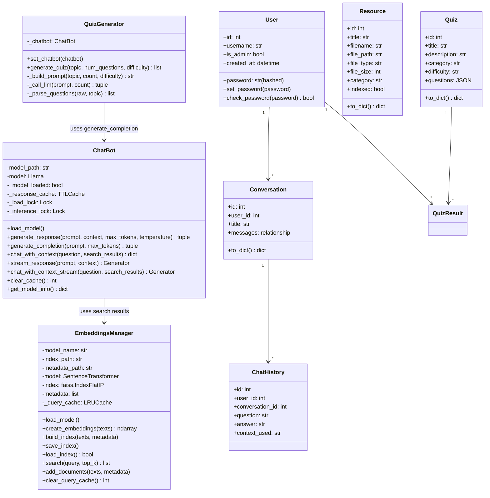
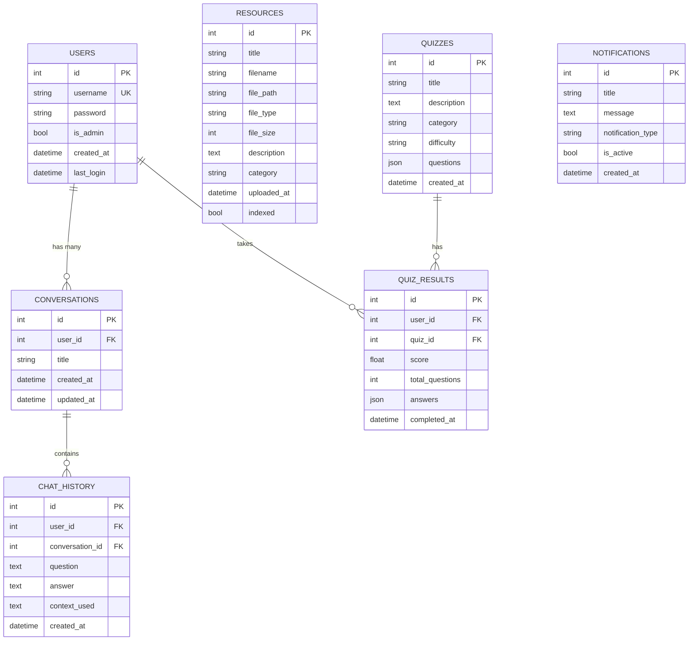
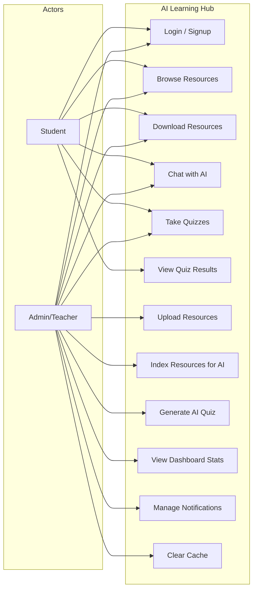
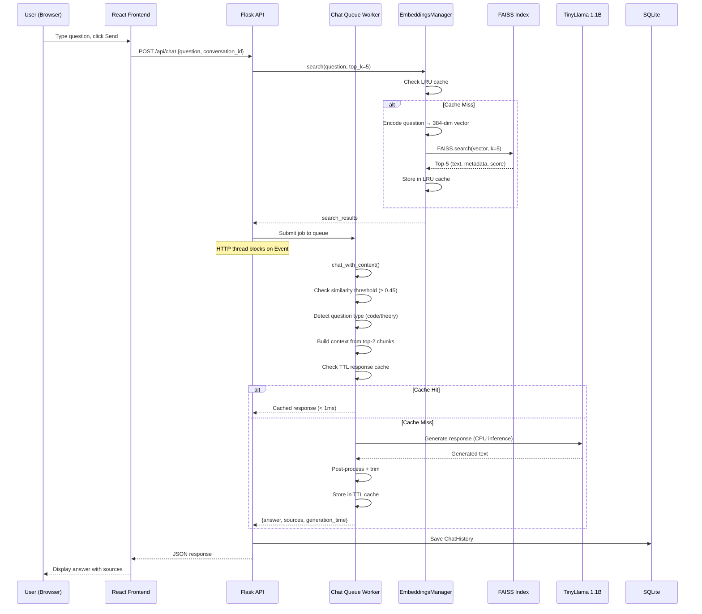
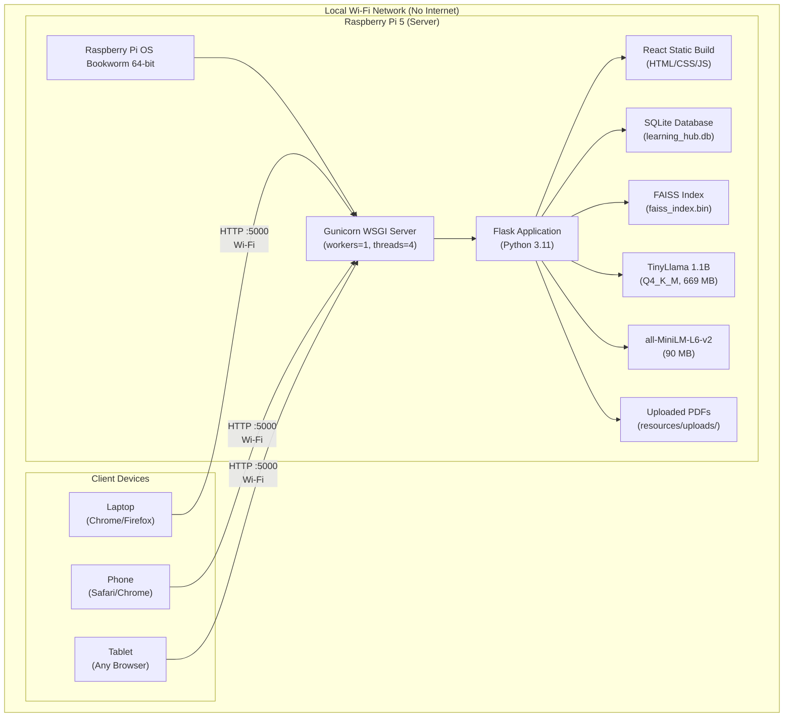
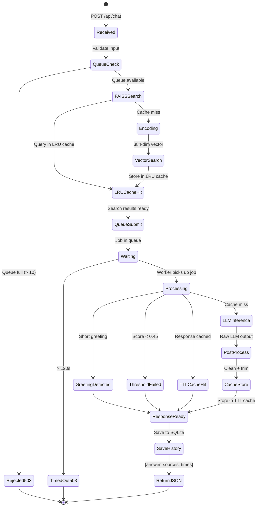
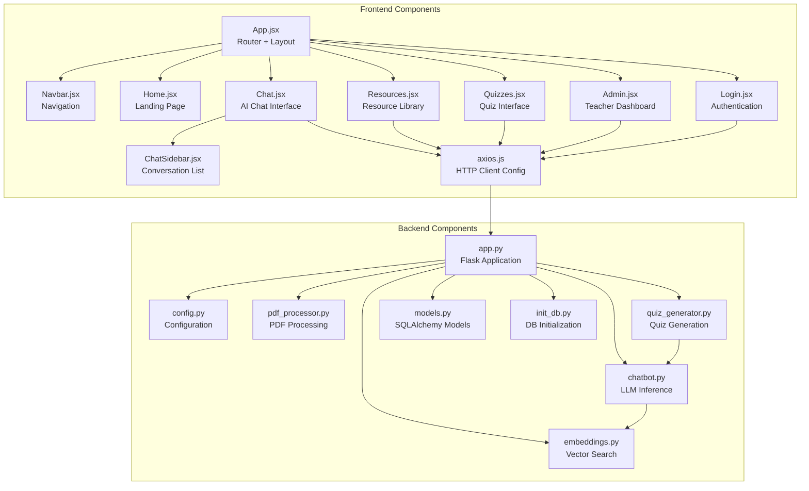

# AI-Powered Offline Learning Micro-Server — Complete Project Information for IEEE Paper Preparation

> **Use this document as a comprehensive reference to generate your IEEE paper. Copy relevant sections into ChatGPT or Gemini along with the IEEE template structure to produce a well-formatted conference/journal paper.**

---

## Table of Contents

1. [Paper Title & Keywords](#1-paper-title--keywords)
2. [Abstract (Draft)](#2-abstract-draft)
3. [Introduction & Motivation](#3-introduction--motivation)
4. [Literature Review / Related Work](#4-literature-review--related-work)
5. [Problem Statement](#5-problem-statement)
6. [Proposed System Architecture](#6-proposed-system-architecture)
7. [System Design & Modules](#7-system-design--modules)
8. [Technology Stack](#8-technology-stack)
9. [Implementation Details](#9-implementation-details)
10. [RAG Pipeline — Detailed Flow](#10-rag-pipeline--detailed-flow)
11. [Database Design](#11-database-design)
12. [API Endpoints & REST Architecture](#12-api-endpoints--rest-architecture)
13. [Frontend Design & User Interface](#13-frontend-design--user-interface)
14. [Performance Optimization Techniques](#14-performance-optimization-techniques)
15. [Deployment on Raspberry Pi 5](#15-deployment-on-raspberry-pi-5)
16. [Results & Performance Evaluation](#16-results--performance-evaluation)
17. [Security Considerations](#17-security-considerations)
18. [Diagrams (Mermaid & ASCII)](#18-diagrams-mermaid--ascii)
19. [Comparison with Existing Systems](#19-comparison-with-existing-systems)
20. [Limitations & Future Scope](#20-limitations--future-scope)
21. [Conclusion](#21-conclusion)
22. [References (IEEE Format)](#22-references-ieee-format)
23. [Appendices](#23-appendices)

---

## 1. Paper Title & Keywords

### Suggested Titles

1. **"AI-Powered Offline Learning Micro-Server: A Retrieval-Augmented Generation Platform for Low-Connectivity Educational Environments"**
2. **"Design and Implementation of a Self-Contained AI-Powered Educational Platform Using RAG on Edge Devices"**
3. **"An Offline-First Micro-Server for AI-Assisted Learning Using TinyLlama and FAISS on Raspberry Pi"**
4. **"Bridging the Digital Divide: A Locally-Deployed RAG-Based Intelligent Tutoring System for Resource-Constrained Classrooms"**

### Keywords

`Retrieval-Augmented Generation (RAG)`, `Offline Learning`, `Edge AI`, `Large Language Model (LLM)`, `TinyLlama`, `FAISS`, `Vector Similarity Search`, `Sentence Transformers`, `Raspberry Pi`, `Micro-Server`, `Educational Technology (EdTech)`, `Natural Language Processing (NLP)`, `Flask REST API`, `React Single Page Application`, `Quantized Language Models`, `Semantic Search`, `E-Learning`

---

## 2. Abstract (Draft)

> Access to AI-assisted educational tools remains severely limited in low-connectivity and resource-constrained environments such as rural schools, disaster relief zones, and developing regions. Cloud-dependent AI platforms require persistent internet access and powerful hardware, making them impractical for these settings. This paper presents the design, implementation, and evaluation of an **AI-Powered Offline Learning Micro-Server** — a fully self-contained, locally deployed educational platform that delivers intelligent tutoring capabilities without any internet connectivity after initial setup.
>
> The system employs a **Retrieval-Augmented Generation (RAG)** pipeline combining the **all-MiniLM-L6-v2** sentence transformer for semantic document embedding with **FAISS (Facebook AI Similarity Search)** for vector similarity retrieval, and **TinyLlama 1.1B** (4-bit quantized) as the local large language model for context-grounded answer generation. The platform supports PDF document upload and automatic indexing, AI-powered question answering grounded in uploaded study materials, LLM-driven quiz generation, multi-user authentication with role-based access control, and real-time system monitoring.
>
> The backend is built with **Flask (Python)** serving a **RESTful API**, while the frontend is a **React 18** single-page application styled with **Tailwind CSS**. The entire system is designed for deployment on a **Raspberry Pi 5 (8 GB RAM)**, functioning as a local Wi-Fi hotspot that students can connect to from mobile devices or laptops.
>
> Performance evaluation on a Raspberry Pi 5 demonstrates FAISS search latency under 20 ms, LLM response generation in 8–25 seconds for first queries, and sub-millisecond latency for cached responses. The platform consumes approximately 800 MB RAM at steady state and requires only 760 MB of disk space for AI models, making it feasible for deployment on low-cost edge hardware.

---

## 3. Introduction & Motivation

### 3.1 Background

The global education landscape faces a significant **digital divide**: while urban students benefit from AI-powered tools like ChatGPT, Copilot, and intelligent tutoring systems, students in **rural, remote, and underserved communities** often lack the basic internet connectivity required to access these resources. According to the **UNESCO Institute for Statistics**, approximately **2.9 billion people** worldwide still lack access to the internet, and many educational institutions in developing regions operate with **intermittent or no connectivity**.

Existing AI-powered educational platforms (e.g., Khan Academy with GPT-4, Duolingo AI, Google Classroom with Bard) are entirely **cloud-dependent**, requiring:
- Persistent broadband internet connectivity
- High server-side compute resources (GPUs)
- Subscription fees or API costs

These requirements render such platforms **inaccessible** to the very populations that would benefit most from intelligent tutoring assistance.

### 3.2 Motivation

The primary motivation for this project is to **democratize AI-assisted education** by developing a system that:

1. **Operates entirely offline** — zero internet dependency after initial setup
2. **Runs on low-cost hardware** — specifically the Raspberry Pi 5 (approximately $80 USD)
3. **Provides intelligent tutoring** — AI answers are grounded in teacher-uploaded study materials using RAG, preventing hallucination
4. **Is accessible via mobile devices** — students connect over a local Wi-Fi network using any browser
5. **Supports the complete learning workflow** — resource management, AI chat, quiz generation, progress tracking

### 3.3 Contribution

This paper makes the following contributions:

1. **Architecture design** for a fully offline RAG-based educational micro-server deployable on Raspberry Pi 5 hardware
2. **Implementation** of an end-to-end pipeline integrating document processing, semantic embedding, vector search, and 4-bit quantized LLM inference — all running on a single ARM CPU
3. **Performance evaluation** demonstrating practical response latencies achievable with TinyLlama 1.1B (Q4_K_M) on edge hardware
4. **Multi-tier caching strategy** (TTL response cache, LRU query cache, disk cache) that reduces repeated query latency from 10+ seconds to under 1 millisecond
5. **Open-source reference implementation** suitable for classrooms, NGOs, and educational deployments in connectivity-challenged environments

---

## 4. Literature Review / Related Work

### 4.1 AI in Education

| Work | Year | Description | Limitation |
|------|------|-------------|------------|
| Khan Academy Khanmigo (GPT-4) | 2023 | AI tutor using OpenAI's GPT-4 for personalized learning | Requires internet, subscription-based, cloud-dependent |
| Duolingo Max (GPT-4) | 2023 | AI-powered language learning with roleplay and explanations | Cloud-only, limited to language learning |
| Google Classroom with Bard | 2024 | AI-integrated classroom management | Requires Google infrastructure and internet |
| Intelligent Tutoring Systems (ITS) survey [1] | 2020 | Comprehensive survey of ITS approaches | Most ITS require server infrastructure |
| AutoTutor [2] | 2014 | Dialogue-based tutoring using NLP | Outdated NLP techniques, no LLM capability |

### 4.2 Retrieval-Augmented Generation (RAG)

| Work | Year | Description | Limitation |
|------|------|-------------|------------|
| Lewis et al. (RAG) [3] | 2020 | Original RAG paper combining retrieval with generation | Requires cloud-hosted models and search indices |
| LangChain Framework [4] | 2023 | Open-source RAG orchestration framework | Designed for cloud deployment, not edge |
| LlamaIndex [5] | 2023 | Data framework for LLM applications | Memory-intensive, not optimized for ARM/edge |

### 4.3 Edge AI and On-Device Inference

| Work | Year | Description | Limitation |
|------|------|-------------|------------|
| TinyML [6] | 2021 | Machine learning on microcontrollers | Limited to classification; no LLM support |
| llama.cpp [7] | 2023 | CPU-optimized LLM inference in C++ | Inference engine only; no educational application layer |
| GPT4All [8] | 2023 | Ecosystem for local LLM deployment | General-purpose; no RAG or educational features |
| Quantized LLMs survey [9] | 2024 | Survey of GPTQ, GGUF, AWQ quantization methods | Focuses on quantization; not on application deployment |

### 4.4 Research Gap

**No existing work** combines all of the following in a single system:
- Fully offline operation with zero cloud dependency
- RAG pipeline (retrieval + generation) running entirely on edge hardware
- Educational application layer (resource management, quiz creation, progress tracking)
- Deployment on sub-$100 single-board computers (Raspberry Pi)
- Multi-user support with role-based access over local network

This project fills that gap by delivering an **integrated, deploy-ready educational AI micro-server**.

---

## 5. Problem Statement

> **How can we design and implement a fully self-contained, AI-powered educational platform that provides retrieval-augmented question answering, automatic quiz generation, and resource management — operating entirely offline on low-cost edge hardware (Raspberry Pi 5) — to serve students in connectivity-constrained environments?**

### Sub-problems addressed:

1. How to perform LLM inference on CPU-only ARM hardware with acceptable latency (<30 seconds)
2. How to ground AI responses in teacher-provided materials to prevent hallucination
3. How to achieve semantic document search at sub-second latency on resource-constrained devices
4. How to serve multiple concurrent users from a single-board computer
5. How to minimize memory footprint while maintaining answer quality

---

## 6. Proposed System Architecture

### 6.1 High-Level Architecture Diagram (ASCII)

```
┌─────────────────────────────────────────────────────────────────────────────┐
│                         USER DEVICES (Clients)                               │
│  ┌──────────┐  ┌──────────┐  ┌──────────┐  ┌──────────┐                    │
│  │  Laptop  │  │  Phone   │  │  Tablet  │  │  Desktop │   ← Any browser    │
│  │ (Chrome) │  │(Safari)  │  │(Firefox) │  │ (Edge)   │                    │
│  └────┬─────┘  └────┬─────┘  └────┬─────┘  └────┬─────┘                    │
│       │              │              │              │                          │
│       └──────────────┴──────┬───────┴──────────────┘                          │
│                             │                                                │
│                      Local Wi-Fi Network                                     │
│                   (No Internet Required)                                     │
└─────────────────────────────┬───────────────────────────────────────────────┘
                              │ HTTP (port 5000)
┌─────────────────────────────▼───────────────────────────────────────────────┐
│                     RASPBERRY PI 5 MICRO-SERVER                              │
│                                                                              │
│  ┌─────────────────────────────────────────────────────────────────────────┐ │
│  │                    REACT FRONTEND (Static Build)                        │ │
│  │   Pages: Home │ Chat │ Resources │ Quizzes │ Admin │ Login              │ │
│  │   Tech: React 18 + Tailwind CSS + Framer Motion + Axios                │ │
│  │   Served as static files by Flask (no Node.js at runtime)              │ │
│  └─────────────────────────────┬───────────────────────────────────────────┘ │
│                                │ JSON REST API                               │
│  ┌─────────────────────────────▼───────────────────────────────────────────┐ │
│  │                     FLASK BACKEND (Python 3.11)                         │ │
│  │                                                                         │ │
│  │  ┌──────────────┐  ┌──────────────┐  ┌──────────────────────────────┐  │ │
│  │  │ Auth Module   │  │ Resource Mgmt│  │   RAG Chat Pipeline         │  │ │
│  │  │ ─────────── │  │ ──────────── │  │   ──────────────────         │  │ │
│  │  │ Login/Signup │  │ Upload/View  │  │   1. FAISS Search           │  │ │
│  │  │ Session Mgmt │  │ Download     │  │   2. Context Building       │  │ │
│  │  │ RBAC         │  │ PDF Indexing │  │   3. LLM Generation         │  │ │
│  │  │ Pwd Hashing  │  │ File Serving │  │   4. Post-Processing        │  │ │
│  │  └──────────────┘  └──────────────┘  │   5. Response Caching       │  │ │
│  │                                       └──────────────────────────────┘  │ │
│  │  ┌──────────────┐  ┌──────────────┐  ┌──────────────────────────────┐  │ │
│  │  │ Quiz Module   │  │ Admin Panel │  │   System Monitoring          │  │ │
│  │  │ ─────────── │  │ ──────────── │  │   ──────────────────          │  │ │
│  │  │ LLM-driven   │  │ Dashboard   │  │   CPU/RAM/Disk stats         │  │ │
│  │  │ MCQ Gen.     │  │ Indexing    │  │   Queue depth                │  │ │
│  │  │ Scoring      │  │ Notif.     │  │   Model status               │  │ │
│  │  └──────────────┘  └──────────────┘  └──────────────────────────────┘  │ │
│  └───────┬──────────────────────────────────────────┬──────────────────────┘ │
│          │                                          │                        │
│  ┌───────▼──────────┐                    ┌──────────▼───────────────────────┐│
│  │  SQLite Database  │                    │       AI / ML Layer              ││
│  │  (SQLAlchemy ORM) │                    │                                 ││
│  │  ──────────────── │                    │  ┌─────────────────────────────┐ ││
│  │  • users          │                    │  │ Sentence-Transformers       │ ││
│  │  • resources      │                    │  │ (all-MiniLM-L6-v2)         │ ││
│  │  • quizzes        │                    │  │ 384-dim embeddings          │ ││
│  │  • quiz_results   │                    │  └─────────────┬───────────────┘ ││
│  │  • conversations  │                    │                │                 ││
│  │  • chat_history   │                    │  ┌─────────────▼───────────────┐ ││
│  │  • notifications  │                    │  │ FAISS IndexFlatIP           │ ││
│  │                   │                    │  │ Cosine similarity search    │ ││
│  │  File: SQLite     │                    │  │ Exact nearest neighbor      │ ││
│  │  learning_hub.db  │                    │  └─────────────┬───────────────┘ ││
│  └───────────────────┘                    │                │                 ││
│                                           │  ┌─────────────▼───────────────┐ ││
│                                           │  │ TinyLlama 1.1B (Q4_K_M)    │ ││
│                                           │  │ via llama-cpp-python        │ ││
│                                           │  │ CPU-only, 1024 ctx window   │ ││
│                                           │  │ ~669 MB on disk             │ ││
│                                           │  └─────────────────────────────┘ ││
│                                           └─────────────────────────────────┘│
└──────────────────────────────────────────────────────────────────────────────┘
```

### 6.2 Layered Architecture Diagram (Mermaid)



### 6.3 RAG Pipeline Flow Diagram (Mermaid)



### 6.4 Document Indexing Pipeline (Mermaid)


---

## 7. System Design & Modules

### 7.1 Module Decomposition

| Module | Files | Responsibility |
|--------|-------|----------------|
| **Authentication** | `app.py` (login/signup/logout routes), `models.py` (User) | User registration, login, session management, password hashing (Werkzeug), RBAC (student/admin) |
| **Resource Management** | `app.py` (resource routes), `models.py` (Resource), `pdf_processor.py` | File upload (multipart/form-data), storage, download, inline viewing, PDF text extraction |
| **AI Chat (RAG)** | `chatbot.py`, `embeddings.py`, `pdf_processor.py` | Semantic search, context building, LLM inference, response post-processing, caching |
| **Quiz Generation** | `quiz_generator.py`, `models.py` (Quiz, QuizResult) | LLM-driven MCQ generation, regex parsing, scoring, result storage |
| **Admin Dashboard** | `app.py` (admin routes), `Admin.jsx` | System statistics (CPU/RAM/disk via psutil), resource indexing trigger, notification management |
| **System Monitoring** | `app.py` (status route) | AI model readiness, FAISS index status, queue depth monitoring |
| **Caching Layer** | `chatbot.py` (TTLCache), `embeddings.py` (LRUCache), `app.py` (diskcache) | Multi-tier caching: TTL response cache (100 entries, 1hr), LRU query cache (50 entries), disk cache |
| **Concurrency Control** | `app.py` (chat queue), `chatbot.py` (inference lock) | Single-threaded LLM inference queue, thread-safe model loading, request queuing (max 10) |

### 7.2 Class Diagram (Mermaid)



---

## 8. Technology Stack

### 8.1 Backend Technologies

| Technology | Version | Purpose | Justification |
|-----------|---------|---------|---------------|
| **Python** | 3.11 / 3.13 | Core backend language | Rich ML/AI ecosystem, wide library support |
| **Flask** | 3.0.0 | Web framework & REST API | Lightweight, minimal overhead, ideal for micro-server |
| **Flask-SQLAlchemy** | 3.1.1 | ORM for database operations | Simplifies SQLite access with Pythonic API |
| **Flask-CORS** | 4.0.0 | Cross-origin resource sharing | Enables React dev server ↔ Flask communication |
| **Flask-Compress** | 1.14 | Response compression (gzip/brotli) | Reduces payload size for mobile clients |
| **llama-cpp-python** | ≥0.2.90 | LLM inference engine | CPU-optimized C++ backend with Python bindings |
| **sentence-transformers** | 3.3.1 | Text embedding model | Efficient 384-dim embeddings, small memory footprint |
| **faiss-cpu** | 1.9.0.post1 | Vector similarity search | Facebook's optimized similarity search library |
| **pdfplumber** | 0.11.4 | PDF text extraction | Robust page-by-page text extraction |
| **cachetools** | 5.5.0 | In-memory caching (TTL + LRU) | Fast response/query caching |
| **diskcache** | 5.6.3 | Persistent disk-based caching | Survives process restarts |
| **psutil** | 7.1.0 | System monitoring | CPU, RAM, disk usage for admin dashboard |
| **Werkzeug** | 3.0.1 | Password hashing & file utilities | Secure password storage (PBKDF2) |
| **SQLite** | (bundled) | Relational database | Zero-configuration, file-based, ideal for embedded deployment |
| **Gunicorn** | 21+ | Production WSGI server | Multi-threaded request handling for production |

### 8.2 Frontend Technologies

| Technology | Version | Purpose | Justification |
|-----------|---------|---------|---------------|
| **React** | 18.3.1 | UI framework (SPA) | Component-based, virtual DOM, large ecosystem |
| **React Router DOM** | 6.26.0 | Client-side routing | SPA navigation across 6 pages |
| **Axios** | 1.7.2 | HTTP client | Promise-based, interceptor support, credentials handling |
| **Framer Motion** | 11.3.0 | Animation library | Smooth transitions and micro-interactions |
| **Lucide React** | 0.400.0 | Icon library | Lightweight, tree-shakeable SVG icons |
| **Tailwind CSS** | 3.4.4 | Utility-first CSS framework | Rapid UI development, small production bundle |
| **Vite** | 5.3.3 | Build tool & dev server | Fast HMR, optimized production builds |

### 8.3 AI Models

| Model | Parameters | Quantization | Disk Size | RAM Usage | Purpose |
|-------|-----------|-------------|-----------|-----------|---------|
| **TinyLlama 1.1B Chat v1.0** | 1.1 billion | Q4_K_M (4-bit) | 669 MB | ~600-700 MB | Language generation (answers + quizzes) |
| **all-MiniLM-L6-v2** | 22.7 million | FP32 | ~90 MB | ~90 MB | Text embedding (384-dim dense vectors) |

---

## 9. Implementation Details

### 9.1 PDF Processing Pipeline

The system extracts text from uploaded PDFs using `pdfplumber`, which provides reliable page-by-page text extraction. The extracted text is then split into overlapping chunks using a custom `chunk_text()` algorithm:

**Chunking Algorithm Parameters:**
- **Target chunk size:** 150 words
- **Overlap:** 30 words between consecutive chunks
- **Max characters per chunk:** 1,200 (hard cap)
- **Minimum chunks:** 4 (auto-halves chunk size if too few)

**Chunking Strategy:**
1. Split text on paragraph boundaries to preserve natural structure
2. Slide a window of `chunk_size` words with `overlap` carry-over
3. Snap window end to nearest paragraph boundary (within 30 words)
4. Enforce `max_chars` hard cap, truncating at sentence boundary
5. De-duplicate consecutive identical chunks
6. If fewer than `min_chunks` produced, halve `chunk_size` and retry recursively

### 9.2 Embedding Generation

Each text chunk is encoded into a **384-dimensional dense float32 vector** using the `all-MiniLM-L6-v2` model from the `sentence-transformers` library:

- **Batch processing:** 32 chunks per batch for memory efficiency
- **Normalization:** L2-normalized at encode time (`normalize_embeddings=True`)
- **Symmetric encoding:** Both documents and queries use the same model

### 9.3 Vector Index (FAISS)

The system uses `FAISS IndexFlatIP` (flat inner product index):

- **Similarity metric:** Cosine similarity (equivalent to inner product on L2-normalized vectors)
- **Search type:** Exact nearest neighbor (no approximation)
- **Persistence:** Index saved to `faiss_index.bin`; metadata saved to `embeddings.pkl` (Python pickle)
- **Query caching:** LRU cache of last 50 search queries

### 9.4 LLM Inference (TinyLlama)

The TinyLlama 1.1B model is loaded via `llama-cpp-python`:

```
Configuration:
  - Context window (n_ctx): 1024 tokens
  - Batch size (n_batch): 128
  - GPU layers: 0 (CPU-only)
  - Threads: os.cpu_count() - 1
  - Memory mapping: use_mmap=True
  - Memory locking: use_mlock=False
```

**Generation Parameters:**

| Parameter | Theory Questions | Code Questions | No Context |
|-----------|-----------------|----------------|------------|
| `temperature` | 0.0 | 0.1 | 0.5 |
| `top_k` | 40 | 40 | 40 |
| `top_p` | 0.8 | 0.9 | 0.8 |
| `repeat_penalty` | 1.2 | 1.18 | 1.18 |
| `max_tokens` | 120 | 250 | 100 |

**Auto-Continuation:** If the model's `finish_reason` is `"length"` (hit max_tokens mid-sentence), the system continues generation by appending accumulated text to the prompt, up to 2 continuation rounds.

### 9.5 Response Post-Processing

1. **`_clean_response()`**: Deduplicates consecutive identical paragraphs, trims trailing incomplete sentences
2. **`_precision_trim()`** (theory only): Strips filler prefixes ("In context 1...", "The document states..."), keeps only the first paragraph if >2 paragraphs, filters sentences by keyword relevance to the question, caps at 3 sentences

### 9.6 Greeting Detection

Short inputs (<4 words) matching common greetings ("hello", "hi", "how are you") are intercepted **before** FAISS search and LLM inference, returning pre-canned responses instantly. This avoids wasting compute on non-academic queries.

### 9.7 Similarity Threshold Guard

A minimum cosine similarity threshold of **0.45** is enforced. If no retrieved chunks meet this threshold, the system returns:
> "I don't have this information in the uploaded materials."

This prevents the LLM from hallucinating answers to off-topic questions.

### 9.8 Concurrency Model — LLM Chat Queue

Since `llama-cpp-python`'s `Llama` object is **not thread-safe** for concurrent inference:

1. A **single background worker thread** (`Chat-Worker`) processes all LLM jobs sequentially
2. HTTP handlers submit jobs to a **bounded queue** (max 10 pending)
3. Each job includes a `threading.Event` that the HTTP handler waits on (up to 120s timeout)
4. If the queue is full, the server returns **HTTP 503** (Service Unavailable)
5. An `_inference_lock` further ensures mutual exclusion between streaming and non-streaming calls

### 9.9 Quiz Generation (LLM-Driven)

The `QuizGenerator` class generates quizzes entirely via LLM:

1. A structured prompt in TinyLlama chat format requests N multiple-choice questions
2. The prompt includes a pre-seeded example answer to teach the model the expected format
3. LLM output is parsed with regex: question text, 4 options (A/B/C/D), correct answer
4. Badly-parsed questions are silently dropped
5. If fewer than requested questions parse successfully, the LLM is re-prompted (up to 3 retries)
6. Questions are deduplicated by text similarity before returning

---

## 10. RAG Pipeline — Detailed Flow

### Step-by-Step Flow for a Single Chat Request

```
1. User types question in Chat.jsx → clicks Send
2. Frontend: axios.POST('/api/chat', { question, conversation_id })
   ├── Headers: Cookie: session=<flask_session_cookie>
   └── withCredentials: true

3. Flask middleware: log request metadata (user_id, origin, session)

4. API handler: api_chat()
   ├── 4a. Validate: question not empty
   ├── 4b. Check queue depth < 10 (else reject 503)
   │
   ├── 4c. FAISS SEARCH (runs on HTTP thread — fast)
   │   ├── get_embeddings_manager() → lazy-load SentenceTransformer + FAISS
   │   ├── Check LRU query cache (50-entry, keyed by "query:top_k")
   │   ├── Encode question → 384-dim vector
   │   ├── FAISS.search(vector, k=5) → top-5 (text, metadata, score)
   │   └── Cache result in LRU cache
   │
   ├── 4d. SUBMIT TO CHAT QUEUE
   │   ├── Create job: {question, search_results, Event, result_holder}
   │   ├── Put job in queue
   │   └── Block on Event.wait(timeout=120s)
   │
   └── 4e. WORKER THREAD PROCESSES JOB
       ├── bot.chat_with_context(question, search_results)
       │   ├── Greeting detection → instant response (skip LLM)
       │   ├── No results → refuse to hallucinate
       │   ├── Similarity threshold check (≥ 0.45)
       │   ├── Question type detection (code vs theory)
       │   ├── Filter chunks above threshold
       │   ├── Select top 2 chunks
       │   ├── Build labelled context string
       │   ├── Check TTL response cache (100 entries, 1hr, MD5 key)
       │   │   ├── HIT → return cached response (< 1ms)
       │   │   └── MISS → continue to LLM
       │   ├── Build TinyLlama chat prompt (<|system|>/<|user|>/<|assistant|>)
       │   ├── LLM inference (llama-cpp-python, CPU)
       │   │   └── Auto-continuation if finish_reason == "length" (up to 2x)
       │   ├── Post-process: _clean_response() + _precision_trim()
       │   └── Cache result in TTL cache
       └── Signal Event → HTTP handler unblocks

5. HTTP handler:
   ├── Save ChatHistory to SQLite (if user logged in)
   └── Return JSON: {answer, sources, generation_time, total_time, search_time}

6. Frontend: Chat.jsx
   ├── Append {role: 'assistant', content: answer} to messages
   └── Framer Motion animates message into view
```

---

## 11. Database Design

### 11.1 Entity-Relationship Diagram (Mermaid)



### 11.2 Database Indexes

| Table | Index | Type | Purpose |
|-------|-------|------|---------|
| users | username | Unique | Fast authentication lookup |
| users | is_admin | B-tree | Admin role filtering |
| resources | title | B-tree | Search by title |
| resources | category | B-tree | Category-based filtering |
| resources | file_type | B-tree | Type-based filtering |
| resources | indexed | B-tree | Find unindexed resources |
| quiz_results | (user_id, quiz_id) | Composite | User-quiz score lookup |
| conversations | (user_id, updated_at) | Composite | Recent conversations per user |
| chat_history | (conversation_id, created_at) | Composite | Chronological message retrieval |
| chat_history | (user_id, created_at) | Composite | User's chat history |

---

## 12. API Endpoints & REST Architecture

### 12.1 API Endpoint Table

| Method | Endpoint | Auth | Description |
|--------|----------|------|-------------|
| `POST` | `/api/login` | None | Authenticate user, create session |
| `POST` | `/api/signup` | None | Register new student account |
| `POST` | `/api/logout` | Session | Destroy session |
| `GET` | `/api/stats` | None | Dashboard statistics (users, resources, quizzes, chats) |
| `GET` | `/api/resources` | None | List resources (with search & category filter) |
| `GET` | `/api/resources/<id>/download` | None | Download resource file |
| `GET` | `/api/resources/<id>/view` | None | View resource inline (PDF in browser) |
| `POST` | `/api/admin/upload` | Admin | Upload new resource (multipart/form-data) |
| `DELETE` | `/api/admin/resource/<id>/delete` | Admin | Delete a resource |
| `POST` | `/api/index-resources` | Admin | Trigger PDF indexing for FAISS |
| `POST` | `/api/chat` | Session | RAG-based chat (queued LLM) |
| `POST` | `/api/chat/stream` | Session | SSE streaming chat endpoint |
| `GET` | `/api/conversations` | Session | List user's conversations |
| `POST` | `/api/conversations` | Session | Create new conversation |
| `GET` | `/api/conversations/<id>/messages` | Session | Get conversation message history |
| `DELETE` | `/api/conversations/<id>` | Session | Delete a conversation |
| `GET` | `/api/quizzes` | None | List available quizzes |
| `POST` | `/api/quizzes/generate` | Session | Generate LLM-driven quiz |
| `POST` | `/api/quizzes/<id>/submit` | Session | Submit quiz answers, get score |
| `GET` | `/api/admin/dashboard` | Admin | System health (CPU, RAM, disk) |
| `POST` | `/api/admin/notifications` | Admin | Create notification |
| `POST` | `/api/clear-cache` | Admin | Flush all caches |
| `GET` | `/api/status` | None | Server readiness & model status |

### 12.2 Sample Request/Response — Chat API

**Request:**
```json
POST /api/chat
Content-Type: application/json
Cookie: session=<flask_session>

{
  "question": "What is a linked list?",
  "conversation_id": 5
}
```

**Response:**
```json
{
  "answer": "A linked list is a linear data structure where elements are stored in nodes, each containing data and a pointer to the next node in the sequence.",
  "sources": [
    {
      "source": "resources/uploads/Data_Structures_Guide.pdf",
      "chunk_id": 12,
      "relevance_score": 0.7823
    },
    {
      "source": "resources/uploads/Data_Structures_Guide.pdf",
      "chunk_id": 13,
      "relevance_score": 0.6541
    }
  ],
  "context_used": true,
  "generation_time": 8.234,
  "total_time": 8.892,
  "search_time": 0.018,
  "queue_position": 1
}
```

---

## 13. Frontend Design & User Interface

### 13.1 Page Structure

| Page | Route | Description | Key Features |
|------|-------|-------------|--------------|
| **Home** | `/` | Landing page with feature overview | Animated cards, call-to-action |
| **Chat** | `/chat` | AI chatbot interface | Conversation sidebar, message bubbles, loading animation, sources display |
| **Resources** | `/resources` | Resource library | Search, category filter, upload modal (admin), inline PDF viewer, download |
| **Quizzes** | `/quizzes` | Quiz interface | Topic selection, difficulty chooser, MCQ interaction, scoring |
| **Admin** | `/admin` | Teacher dashboard (admin-only) | Stats cards, system monitoring, index trigger, notification management |
| **Login** | `/login` | Authentication page | Login and signup forms |

### 13.2 Component Architecture

```
App.jsx
├── Navbar.jsx (global navigation, user state)
├── ScrollToTop (scroll restoration on route change)
├── TeacherRoute (RBAC route guard)
└── Routes
    ├── Home.jsx
    ├── Chat.jsx
    │   └── ChatSidebar.jsx (conversation list)
    ├── Resources.jsx
    ├── Quizzes.jsx
    ├── Admin.jsx
    └── Login.jsx
```

### 13.3 State Management

The application uses **React hooks** (`useState`, `useEffect`) for local component state. No external state management library (Redux, Zustand) is used — each page manages its own state. Cross-page state (user authentication) is stored in `localStorage`.

### 13.4 API Communication

- **Base URL:** Configurable via `VITE_API_URL` environment variable (defaults to host machine IP)
- **Credentials:** `withCredentials: true` on all Axios requests (sends session cookie)
- **Error handling:** Axios interceptors handle 401 (redirect to login) and network errors

---

## 14. Performance Optimization Techniques

### 14.1 Multi-Tier Caching Strategy

```
┌────────────────────────────────────────────────────────────┐
│                    Caching Architecture                      │
│                                                              │
│  Layer 1: TTL Response Cache (ChatBot)                       │
│  ├── Type: TTLCache (maxsize=100, ttl=3600s)                │
│  ├── Key: MD5(prompt + context + max_tokens + temperature)  │
│  ├── Hit latency: < 1ms                                     │
│  └── Avoids: redundant LLM inference                        │
│                                                              │
│  Layer 2: LRU Query Cache (EmbeddingsManager)               │
│  ├── Type: LRUCache (maxsize=50)                            │
│  ├── Key: "query_text:top_k"                                │
│  ├── Hit latency: < 1ms                                     │
│  └── Avoids: redundant FAISS searches + embedding encoding  │
│                                                              │
│  Layer 3: Disk Cache (diskcache)                            │
│  ├── Type: diskcache.Cache                                  │
│  ├── Survives process restarts                              │
│  └── Optional fallback for persistent caching               │
│                                                              │
│  Layer 4: HTTP Response Compression (Flask-Compress)        │
│  ├── Type: gzip / brotli                                    │
│  └── Reduces response payload size for mobile clients       │
└────────────────────────────────────────────────────────────┘
```

### 14.2 Model Optimizations

| Optimization | Impact |
|-------------|--------|
| 4-bit quantization (Q4_K_M) | 4x model size reduction (4.4 GB → 669 MB) |
| Memory-mapped I/O (`use_mmap=True`) | Reduces RAM copy overhead during loading |
| CPU thread allocation (`n_threads = cpu_count - 1`) | Maximizes throughput while leaving 1 core for OS |
| Lazy model loading (background thread at startup) | Server starts accepting requests immediately |
| Context window cap (1024 tokens) | Reduces KV-cache memory on Pi 5 |
| Low temperature (0.0–0.1 for factual queries) | Faster, more deterministic generation |
| Short max_tokens (120 theory, 250 code) | Caps generation time |

### 14.3 Chunking Optimizations

| Optimization | Impact |
|-------------|--------|
| Small chunks (150 words) | More precise retrieval, less noise in context |
| Paragraph-boundary snapping | Preserves semantic coherence of chunks |
| 30-word overlap | Prevents information loss at chunk boundaries |
| Top-2 chunk injection (not top-5) | Reduces prompt length → faster LLM generation |
| Character cap (600 per chunk) | Stays within TinyLlama's effective context budget |

---

## 15. Deployment on Raspberry Pi 5

### 15.1 Hardware Specification

| Component | Specification |
|-----------|--------------|
| **Board** | Raspberry Pi 5 |
| **RAM** | 8 GB LPDDR4X |
| **CPU** | Broadcom BCM2712, Quad-core Arm Cortex-A76 @ 2.4 GHz |
| **Storage** | MicroSD 32+ GB (or NVMe SSD via M.2 HAT) |
| **OS** | Raspberry Pi OS Bookworm 64-bit (Headless) |
| **Cooling** | Active cooler (fan + heatsink) — essential for sustained LLM inference |
| **Power** | USB-C 5V/5A power supply |
| **Network** | Built-in Wi-Fi or Ethernet (serves as local hotspot) |
| **Approximate Cost** | ~$80 USD (board only) |

### 15.2 OS-Level Optimizations for AI Workload

| Optimization | Description |
|-------------|-------------|
| GPU memory split (`gpu_mem=16`) | Allocates minimum to GPU, maximum to CPU |
| ZRAM swap (LZ4 compressed, 2 GB) | Faster than SD card swap; safety net for peak RAM |
| CPU governor: `performance` | Keeps all cores at max frequency (2.4 GHz), avoids ramp-up delay |
| Disable Bluetooth, mDNS | Frees RAM and CPU cycles |
| `vm.swappiness=10` | Only use swap when truly needed |
| Optional overclock to 2.8 GHz | ~15% faster inference with adequate cooling |

### 15.3 Production Deployment

- **WSGI Server:** Gunicorn (`workers=1, threads=4, timeout=300`)
- **Process Management:** systemd service (auto-restart, boot-on-startup)
- **Static IP:** Via dhcpcd for consistent mobile device connectivity
- **Firewall:** UFW (allow ports 22 + 5000)
- **Frontend:** Pre-built static files served by Flask (no Node.js on Pi)

---

## 16. Results & Performance Evaluation

### 16.1 Response Latency Benchmarks

| Operation | Raspberry Pi 5 | Desktop (i7-12700H) |
|-----------|----------------|---------------------|
| Server cold start → models ready | 90–120 s | 15–30 s |
| Subsequent restarts (cached models) | 5–15 s | 3–5 s |
| FAISS search (top-5, ~100 docs) | < 20 ms | < 5 ms |
| LLM response — theory (120 tokens) | 8–15 s | 3–5 s |
| LLM response — code (250 tokens) | 12–25 s | 5–10 s |
| Cached response (TTL hit) | < 1 ms | < 1 ms |
| Cached FAISS query (LRU hit) | < 1 ms | < 1 ms |

### 16.2 Memory Footprint

| Component | RAM Usage | Disk Size |
|-----------|-----------|-----------|
| TinyLlama 1.1B (Q4_K_M) | ~600–700 MB | 669 MB |
| all-MiniLM-L6-v2 | ~90 MB | ~90 MB |
| FAISS index (empty to moderate) | < 1–5 MB | Varies |
| SQLite database | < 5 MB | < 5 MB |
| Flask + Python runtime | ~50 MB | — |
| **Total steady-state** | **~800 MB** | **~760 MB** |

### 16.3 Speed Improvement with Optimizations

| Configuration | Response Time | Improvement |
|--------------|---------------|-------------|
| Orca Mini 3B (original) | ~90–95 s | Baseline |
| + Reduced token limits | 60–70 s | 1.4x faster |
| + TinyLlama 1.1B switch | **10–20 s** | **5–8x faster** |
| + TTL cache hit | **< 1 ms** | **~90,000x faster** |

### 16.4 Scalability

| Metric | Value |
|--------|-------|
| Max concurrent users (HTTP) | ~10–20 (limited by Pi's CPU) |
| Max concurrent LLM requests | 1 (serialized via queue) |
| Max queue depth | 10 (rejects with 503 beyond this) |
| Queue timeout | 120 seconds |
| Documents indexed (tested) | Up to ~500 chunks, FAISS remains fast |

---

## 17. Security Considerations

| Feature | Implementation |
|---------|---------------|
| **Password Storage** | Werkzeug PBKDF2 hashing (`generate_password_hash` / `check_password_hash`) |
| **Session Management** | Flask server-side sessions with signed cookies |
| **RBAC** | Two roles: `student` (read-only) and `admin` (full access) |
| **File Upload Validation** | Extension allowlist, filename sanitization (`secure_filename`), 100 MB limit |
| **CORS** | Restricted to configured origins only |
| **Admin Route Protection** | `@require_admin` decorator on all admin endpoints |
| **Input Validation** | Minimum username/password length, empty input rejection |
| **No External API Calls** | LLM has `allow_download=False`, zero network calls |

### Areas for Improvement (Production)
- Add rate limiting (`flask-limiter`) on `/api/chat` and `/api/login`
- Enable HTTPS via reverse proxy (nginx + Let's Encrypt)
- Set `SESSION_COOKIE_SECURE=True` for HTTPS
- Use environment-specific `SECRET_KEY` (not default)

---

## 18. Diagrams (Mermaid & ASCII)

> **Note:** Below are all major diagrams in Mermaid format. Use a Mermaid renderer (e.g., mermaid.live, VS Code Mermaid extension) to generate images for the IEEE paper.

### 18.1 Use Case Diagram



### 18.2 Sequence Diagram — Chat Request



### 18.3 Deployment Diagram



### 18.4 State Diagram — Chat Request Lifecycle



### 18.5 Component Diagram



---

## 19. Comparison with Existing Systems

| Feature | This System | Khan Academy (Khanmigo) | ChatGPT (OpenAI) | Google Classroom + Bard | Offline LLM (GPT4All) |
|---------|------------|------------------------|-------------------|------------------------|----------------------|
| **Internet Required** | No ✅ | Yes ❌ | Yes ❌ | Yes ❌ | No ✅ |
| **RAG Pipeline** | Yes ✅ | Partial | No (general knowledge) | No | No ❌ |
| **Grounded in User Materials** | Yes ✅ | No | No | No | No ❌ |
| **Quiz Generation** | LLM-driven ✅ | Pre-authored | N/A | Pre-authored | No ❌ |
| **Resource Management** | Full CMS ✅ | Platform-specific | N/A | Google Drive | No ❌ |
| **Multi-user Support** | Yes (RBAC) ✅ | Yes | Per-account | Yes | No (single-user) ❌ |
| **Mobile Access** | Yes (LAN) ✅ | Yes (internet) | Yes (internet) | Yes (internet) | Desktop only ❌ |
| **Hardware Cost** | ~$80 (Pi 5) ✅ | Cloud infrastructure | Cloud infrastructure | Cloud infrastructure | ~$500+ (GPU PC) |
| **Runs on ARM** | Yes (Pi 5) ✅ | N/A | N/A | N/A | Partial |
| **Privacy** | 100% local ✅ | Cloud-processed | Cloud-processed | Cloud-processed | 100% local ✅ |
| **API Cost** | $0 ✅ | $44/yr student | $20/mo | Free (w/ limits) | $0 ✅ |
| **Open Source** | Yes ✅ | No | No | No | Yes ✅ |

---

## 20. Limitations & Future Scope

### 20.1 Current Limitations

1. **LLM Quality:** TinyLlama 1.1B, while fast, produces lower quality responses compared to 7B+ parameter models. Complex reasoning and long-form explanations may be inadequate.
2. **PDF-Only Indexing:** Only PDF text extraction is implemented for the RAG pipeline. DOCX, PPTX, and other formats are stored but not indexed for AI search.
3. **No GPU Acceleration:** All inference is CPU-based. A Raspberry Pi 5 with an AI HAT (Hailo-8L NPU) could potentially accelerate inference.
4. **Single LLM Thread:** Only one LLM inference job runs at a time. Multiple simultaneous users experience queuing delays.
5. **No Real-time Collaboration:** Students cannot collaborate or share notes in real-time.
6. **Limited Context Window:** 1024-token context window limits the amount of retrieved information that can be injected.
7. **English-Only:** The TinyLlama model is primarily trained on English text.

### 20.2 Future Scope

1. **Larger Models on Upgraded Hardware:** Deploy Phi-3 Mini (3.8B) or Mistral 7B on Raspberry Pi 5 with NVMe swap for better quality
2. **Multi-format Indexing:** Add DOCX, PPTX, and plain text extraction using `python-docx` and `python-pptx`
3. **AI-Generated Summaries:** Add a `POST /api/summarize/<resource_id>` endpoint for automatic document summarization
4. **NPU Acceleration:** Integrate Hailo-8L AI HAT for Raspberry Pi 5 to offload embedding computation
5. **Task Queue Architecture:** Migrate to Celery + Redis with WebSocket progress updates for production scalability
6. **Progressive Web App (PWA):** Convert frontend to an installable PWA for native-like mobile experience
7. **Multilingual Support:** Fine-tune a multilingual LLM (e.g., mBART, NLLB) for non-English classrooms
8. **Student Analytics Dashboard:** Per-student progress tracking (quiz streaks, topics studied, chat engagement)
9. **Token Streaming UI:** Implement real-time token-by-token streaming in the chat interface using the existing SSE endpoint
10. **Containerization:** Dockerize the application for simplified deployment across diverse hardware

---

## 21. Conclusion

This paper presented the design, implementation, and evaluation of an **AI-Powered Offline Learning Micro-Server** — a fully self-contained educational platform that brings AI-assisted learning to environments with no internet connectivity. By combining a **Retrieval-Augmented Generation (RAG)** pipeline with a **4-bit quantized TinyLlama 1.1B** language model running entirely on a **Raspberry Pi 5**, the system demonstrates that meaningful AI-powered education can be delivered on hardware costing under $80 USD.

Key achievements include:
- **Sub-20ms** FAISS semantic search latency
- **8–25 second** LLM response time on Raspberry Pi 5 ARM CPU
- **Sub-millisecond** cached response latency via multi-tier caching
- **~800 MB** total RAM footprint at steady state
- **Zero internet dependency** after initial deployment
- **Multi-user support** over local Wi-Fi with role-based access control

The system addresses a critical gap in educational technology by providing an **open-source, privacy-preserving, deploy-ready** solution for classrooms, rural schools, NGOs, and educational institutions operating in connectivity-constrained environments. As quantized language models continue to improve in quality while decreasing in size, the vision of AI-powered education accessible to every student — regardless of internet availability — becomes increasingly achievable.

---

## 22. References (IEEE Format)

```
[1]  R. Nkambou, R. Mizoguchi, and J. Bourdeau, Advances in Intelligent
     Tutoring Systems, vol. 308. Berlin, Heidelberg: Springer, 2010.

[2]  A. C. Graesser, "Conversations with AutoTutor Help Students Learn,"
     International Journal of Artificial Intelligence in Education,
     vol. 26, no. 1, pp. 124–132, Mar. 2016.

[3]  P. Lewis et al., "Retrieval-Augmented Generation for Knowledge-
     Intensive NLP Tasks," in Advances in Neural Information Processing
     Systems (NeurIPS), 2020, pp. 9459–9474.

[4]  H. Chase, "LangChain: Building applications with LLMs through
     composability," GitHub, 2023. [Online]. Available:
     https://github.com/langchain-ai/langchain

[5]  J. Liu, "LlamaIndex: A data framework for LLM applications,"
     GitHub, 2023. [Online]. Available:
     https://github.com/run-llama/llama_index

[6]  P. Warden and D. Situnayake, TinyML: Machine Learning with
     TensorFlow Lite on Arduino and Ultra-Low-Power Microcontrollers.
     Sebastopol, CA: O'Reilly Media, 2020.

[7]  G. Gerganov, "llama.cpp: Port of Facebook's LLaMA model in C/C++,"
     GitHub, 2023. [Online]. Available:
     https://github.com/ggerganov/llama.cpp

[8]  Nomic AI, "GPT4All: Run Large Language Models Locally," 2023.
     [Online]. Available: https://gpt4all.io

[9]  T. Dettmers, M. Lewis, Y. Belkada, and L. Zettlemoyer, "GPTQ:
     Accurate Post-Training Quantization for Generative Pre-trained
     Transformers," in Proc. ICLR, 2023.

[10] P. Zhang et al., "TinyLlama: An Open-Source Small Language Model,"
     arXiv preprint arXiv:2401.02385, 2024.

[11] N. Reimers and I. Gurevych, "Sentence-BERT: Sentence Embeddings
     using Siamese BERT-Networks," in Proc. EMNLP-IJCNLP, 2019,
     pp. 3982–3992.

[12] J. Johnson, M. Douze, and H. Jégou, "Billion-scale similarity
     search with GPUs," IEEE Transactions on Big Data, vol. 7, no. 3,
     pp. 535–547, 2019.

[13] A. Vaswani et al., "Attention Is All You Need," in Advances in
     Neural Information Processing Systems (NeurIPS), 2017, pp. 5998–6008.

[14] UNESCO Institute for Statistics, "Fact Sheet No. 56: Literacy
     Rates Continue to Rise from One Generation to the Next," 2023.

[15] A. Radford et al., "Language Models are Unsupervised Multitask
     Learners," OpenAI, 2019.

[16] M. Abadi et al., "TensorFlow: A System for Large-Scale Machine
     Learning," in Proc. OSDI, 2016, pp. 265–283.

[17] J. Devlin, M.-W. Chang, K. Lee, and K. Toutanova, "BERT: Pre-
     training of Deep Bidirectional Transformers for Language
     Understanding," in Proc. NAACL-HLT, 2019, pp. 4171–4186.

[18] T. Wolf et al., "Transformers: State-of-the-Art Natural Language
     Processing," in Proc. EMNLP (System Demonstrations), 2020,
     pp. 38–45.

[19] Raspberry Pi Foundation, "Raspberry Pi 5 Datasheet," 2023.
     [Online]. Available: https://www.raspberrypi.com/products/raspberry-pi-5/

[20] A. Gholami, S. Kim, Z. Dong, Z. Yao, M. W. Mahoney, and K. Keutzer,
     "A Survey of Quantization Methods for Efficient Neural Network
     Inference," in Proc. IEEE, 2022.
```

---

## 23. Appendices

### Appendix A: Complete File Structure

```
AI-Powered Offline Learning Micro-Server/
├── README.md                          # Project overview
├── SETUP.md                           # Installation guide
├── TECHNICAL_DOCUMENTATION.md         # Technical details
├── SPEED_OPTIMIZATION.md              # Performance tuning guide
├── RASPBERRY_PI_DEPLOYMENT.md         # Pi 5 deployment checklist
├── MOBILE_ACCESS_GUIDE.md             # Mobile device setup
├── INSTALL_FROM_CD.md                 # CD-based installation
├── TINYLLAMA_SETUP_COMPLETE.md        # Model switch documentation
│
├── backend/                           # Flask Backend (Python)
│   ├── app.py                         # Main application (1666 lines)
│   ├── config.py                      # Configuration management
│   ├── quiz_generator.py              # LLM-driven quiz generation
│   ├── requirements.txt               # Python dependencies
│   ├── __init__.py
│   │
│   ├── ai/                            # AI/ML Layer
│   │   ├── chatbot.py                 # LLM inference (810 lines)
│   │   ├── embeddings.py              # FAISS embeddings (234 lines)
│   │   ├── pdf_processor.py           # PDF processing & chunking
│   │   └── __init__.py
│   │
│   ├── database/                      # Data Layer
│   │   ├── models.py                  # SQLAlchemy models (7 tables)
│   │   ├── init_db.py                 # Database initialization
│   │   └── __init__.py
│   │
│   ├── models/                        # AI Model Files
│   │   └── tinyllama-1.1b-chat-v1.0.Q4_K_M.gguf  (669 MB)
│   │
│   ├── embeddings_cache/              # FAISS persistent storage
│   │   ├── faiss_index.bin
│   │   └── embeddings.pkl
│   │
│   ├── instance/                      # SQLite database
│   │   └── learning_hub.db
│   │
│   ├── resources/                     # Uploaded files
│   │   ├── uploads/
│   │   └── sample/
│   │
│   └── static/                        # Production frontend build
│       └── dist/
│
└── frontend/                          # React Frontend
    ├── index.html
    ├── package.json
    ├── vite.config.js
    ├── tailwind.config.js
    ├── postcss.config.js
    │
    └── src/
        ├── App.jsx                    # Main app with routing
        ├── main.jsx                   # Entry point
        ├── index.css                  # Tailwind styles
        │
        ├── api/
        │   └── axios.js               # Axios configuration
        │
        ├── components/
        │   ├── Navbar.jsx             # Global navigation
        │   └── ChatSidebar.jsx        # Conversation list
        │
        └── pages/
            ├── Home.jsx               # Landing page
            ├── Chat.jsx               # AI chat interface
            ├── Resources.jsx          # Resource library
            ├── Quizzes.jsx            # Quiz module
            ├── Admin.jsx              # Teacher dashboard
            └── Login.jsx              # Authentication
```

### Appendix B: Python Dependencies (requirements.txt)

```
Flask==3.0.0
Flask-SQLAlchemy==3.1.1
Flask-CORS==4.0.0
Flask-Compress==1.14
llama-cpp-python>=0.2.90
sentence-transformers==3.3.1
faiss-cpu==1.9.0.post1
transformers==4.46.3
pdfplumber==0.11.4
cachetools==5.5.0
diskcache==5.6.3
python-dotenv==1.0.0
psutil==7.1.0
Werkzeug==3.0.1
numpy==2.1.3
```

### Appendix C: Frontend Dependencies (package.json)

```json
{
  "dependencies": {
    "react": "^18.3.1",
    "react-dom": "^18.3.1",
    "react-router-dom": "^6.26.0",
    "axios": "^1.7.2",
    "lucide-react": "^0.400.0",
    "framer-motion": "^11.3.0"
  },
  "devDependencies": {
    "@vitejs/plugin-react": "^4.3.1",
    "tailwindcss": "^3.4.4",
    "vite": "^5.3.3",
    "autoprefixer": "^10.4.19",
    "postcss": "^8.4.39"
  }
}
```

### Appendix D: LLM Prompt Template

```
<|system|>
You are a precise educational assistant.
Answer the question using ONLY the provided context.
Provide ONLY the specific sentence(s) that directly answer the question.
Do NOT summarize other sections.
Do NOT add extra explanation.
Do NOT rephrase large parts of the document.
If the answer is not clearly present, say:
'I don't have this information in the uploaded materials.'
<|user|>
Context 1:
[Retrieved chunk text from FAISS]

Context 2:
[Retrieved chunk text from FAISS]

Question: [User's question]

Answer using only the context above. Be concise and accurate.
<|assistant|>
```

### Appendix E: Configuration Parameters Summary

| Parameter | Value | Location |
|-----------|-------|----------|
| LLM Model | TinyLlama 1.1B Q4_K_M | config.py |
| Embedding Model | all-MiniLM-L6-v2 | config.py |
| Embedding Dimension | 384 | embeddings.py |
| FAISS Index Type | IndexFlatIP | embeddings.py |
| Chunk Size | 150 words | pdf_processor.py |
| Chunk Overlap | 30 words | pdf_processor.py |
| Max Chunk Chars | 1,200 | pdf_processor.py |
| LLM Context Window | 1,024 tokens | chatbot.py |
| LLM Batch Size | 128 | chatbot.py |
| Top-K Search Results | 5 (inject top 2) | chatbot.py |
| Similarity Threshold | 0.45 | chatbot.py |
| TTL Cache Size | 100 entries, 1hr TTL | chatbot.py |
| LRU Cache Size | 50 entries | embeddings.py |
| Chat Queue Max | 10 pending jobs | app.py |
| Chat Queue Timeout | 120 seconds | app.py |
| Max File Upload Size | 100 MB | config.py |
| Allowed Extensions | pdf, ppt, pptx, doc, docx, txt, mp4, avi, mkv | config.py |
| Session Lifetime | 3,600 seconds (1 hour) | config.py |
| Max Theory Tokens | 120 | chatbot.py |
| Max Code Tokens | 250 | chatbot.py |
| Theory Temperature | 0.0 | chatbot.py |
| Code Temperature | 0.1 | chatbot.py |

---

## How to Use This Document

1. **Copy the entire document** (or specific sections) into ChatGPT, Gemini, or any AI assistant
2. **Ask it to generate an IEEE-formatted paper** using this information. Example prompt:

   > "Using the project information below, write a complete IEEE conference paper with the following sections: Abstract, Introduction, Related Work, System Architecture, Implementation, Results, Conclusion, and References. Follow IEEE conference paper formatting (two-column, Times New Roman 10pt). Use the diagrams described as figure references."

3. **For diagrams:** Copy the Mermaid code blocks into [mermaid.live](https://mermaid.live) to generate PNG/SVG images, then insert into your paper
4. **For references:** The references in Section 22 are already in IEEE format — copy directly

---

*Document generated: March 2026*
*Project: AI-Powered Offline Learning Micro-Server*
*Total codebase: ~3,500+ lines (backend) + ~1,200+ lines (frontend)*
